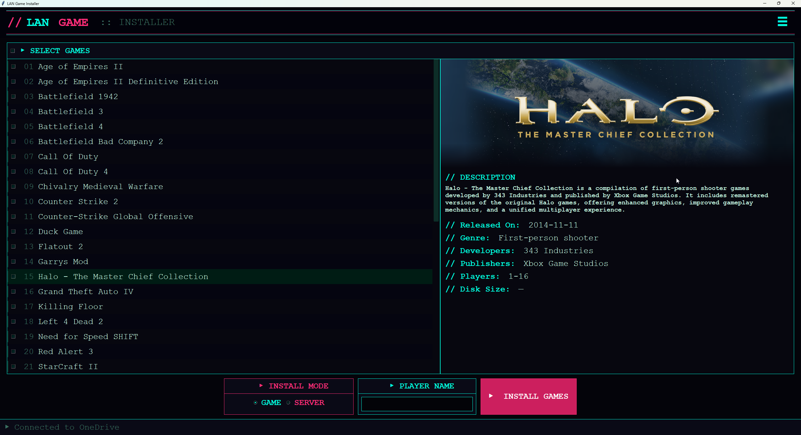

# LAN Game Installer

LAN Game Installer is a batch installer designed for LAN parties, built to work in both offline and with an OneDrive backend. You can run it entirely from local files when there’s no internet, or use OneDrive to sync a shared game list and pull installers on demand.

Simply browse the available games, select what you want, set your player name and install everything in one batch.



## Getting Started

1. **Launch** `LAN Game Installer.exe`. If Windows asks for administrator permission, click **Yes**.
2. The main window shows all available games you have configued in your `config\games.yaml`
3. *(Optional)* Copy the folder `examples\config` folder from the source code of this release to your machine to see a sample configuration.

## How OneDrive sync works

LAN Game Installer can automatically download game installers and configuration files from a shared OneDrive folder. This is useful as games can be downloaded and installed at home rather than during an event.

- If a OneDrive **Download URL** is set in the settings, the app will sync the game list and installers from that online folder.
- All YAML files in the `config` folder (such as `games.yaml`, `filter.yaml`, and `usersettings.yaml`) will automatically sync from OneDrive
- Only the files needed for the games you select will be downloaded to your computer.
- The app checks file integrity to avoid re-downloading files you already have.
- You can disable OneDrive syncing or downloads in the settings if you want to use only local files.

1. Ask your LAN organiser for the OneDrive download link.
2. Paste the link into the **Download URL** field in the settings panel.
3. The app will show progress as it downloads or updates files.
4. Once synced, you can install games as usual.

## Installing Games

1. **Select games** — Click a row (or its checkbox) to select a game. Use the **ALL** checkbox in the header to select every game at once.
2. **Enter your player name** — Type your name into the **PLAYER NAME** box. This is required for all installations.
3. **Click INSTALL SELECTED** and a folder picker will open. Choose where you want the games installed (e.g. `C:\Games`). Each game will be placed in its own subfolder.
5. The batch download and installation of all your selected games will now start.
6. Partially downloaded games will resume if interrupted.

## Configuring Settings

1. **Disable Game Sync**  
  Stops updating the game list from OneDrive

2. **Disable Downloads**  
  Toggle to install from local files only.

3. **Download Only**  
  When the OneDrive URL is configured you can just download files without installing the game.

4. **Games Filter**  
  Menu to filter the games list to a smaller sub set.

5. **Download URL**  
  Set the source OneDrive URL for downloading the game list and installers.

# LAN Organisers

If you are setting up LAN Game Installer for an event:

1. Distribute `LAN Game Installer.exe` and the `config\` folder together in one directory, or host it on a shared OneDrive link.
2. *(Optional)* Distribute the `Installers\` folder containing all the game installer files for a fully offline installation.
3. *(Optional)* Create a `config\filter.yaml` to restrict which games are shown to players.
4. *(Optional)* Put game banner images in the folder config\images\game.png with the matching name from the games.yaml file. Use the website https://www.steamgriddb.com/ and download files in format 920x430.

**Folder Structure Example:**

OneDrive Shared Folder Link or Local files

```
LAN Game Installer.exe
├── config/
│   ├── games.yaml            # Contains game metadata and installation paths
│   ├── usersettings.yaml     # (optional) Contains all settings from the hamburger setting panel
│   ├── filter.yaml           # (optional) Used to filter list of games from games.yaml 
│   └── images/
│       └── <game>.png        # (optional)
└── Installers/
    └── <Game Name>/
        └── game/
            └── <Installer files>
```

## Example games.yaml entries

```yaml
games:
  # Example for an EXE Setup installer
  - name: Example Game EXE
    type: game
    installer_type: exe_setup
    base_path: Installers/Example Game EXE/game
    install_exe: ExampleGameSetup.exe
    parameters: '/SILENT /SUPPRESSMSGBOXES /NORESTART /DIR="{target_dir}" /PLAYERNAME="{player}"'
    input_box:
    - value: "server_address"
      title: "Server IP Address"
      description: "Enter the IP address"
    prerequisites: []
    description: "Example description of the game"
    release_date: 2013-10-29
    genre: First-person shooter
    developer: Example Studio
    publisher: Example Publisher
    player_count: 1-64
    
  # Example for an MSI installer
  - name: Example Game MSI
    type: game
    installer_type: msi
    base_path: Installers/Example Game MSI/game
    install_msi: ExampleGame.msi
    parameters: 'INSTALLDIR="{target_dir}" PLAYERNAME="{player}"'
    prerequisites: []
    description: "A sample game installed via MSI."
    release_date: 2020-01-01
    genre: Strategy
    developer: Example Studio
    publisher: Example Publisher
    player_count: 1-4
```
## Configuring Custom Installer Parameters and Input Values

You can define custom input fields for each game in your `app/config/games.yaml` file using the `input_box` section. These fields prompt the user for additional values during installation (for example, a server IP address). You can then reference these values in the `parameters` string for the installer.

### Referencing Built-in and Custom Variables

In the `parameters` field for each game, you can use the following placeholders:

- `{target_dir}` — The folder selected by the user for installation. Automatically set by the app.
- `{player}` — The player name entered in the main window. Automatically set by the app.
- `{your_custom_value}` — Any value defined in the `input_box` section for that game. The placeholder name must match the `value` key in the `input_box` entry.

#### Example: Custom Input Value

```yaml
- name: Battlefield Bad Company 2
  installer_type: exe_setup
  base_path: Installers/Battlefield Bad Company 2/Game
  install_exe: Battlefield Bad Company 2.exe
  parameters: '/SILENT /DIR="{target_dir}" /PLAYERNAME="{player}" /SERVERADDRESS="{server_address}"'
  input_box:
    - value: "server_address"
      title: "Server IP Address"
      description: "Enter the IP address of the Battlefield Bad Company 2 server (e.g. 192.168.1.1)"
  # ...other fields...
```

When this game is selected for installation, the app will prompt the user to enter a value for `server_address`. The value entered will be substituted into the `{server_address}` placeholder in the `parameters` string.

#### Example: Built-in Variables Only

```yaml
- name: Age of Empires II
  installer_type: msi
  base_path: Installers/Age of Empires II/game
  install_msi: Age of Empires II.msi
  parameters: 'INSTALLDIR="{target_dir}" PLAYERNAME="{player}"'
  # ...other fields...
```

Here, `{target_dir}` and `{player}` are automatically set by the app and do not require an `input_box` entry.

## Game Filters

- The currently active filter is set by the `games_filter` key in `app/config/usersettings.yaml` (e.g., `games_filter: Test LAN Party`).
- Filters must be manually created and saved in `app/config/filter.yaml` using the following schema:

```yaml
filters:
  - name: <Filter Name>
    games:
      - <Game Name 1>
      - <Game Name 2>
      # ...
```